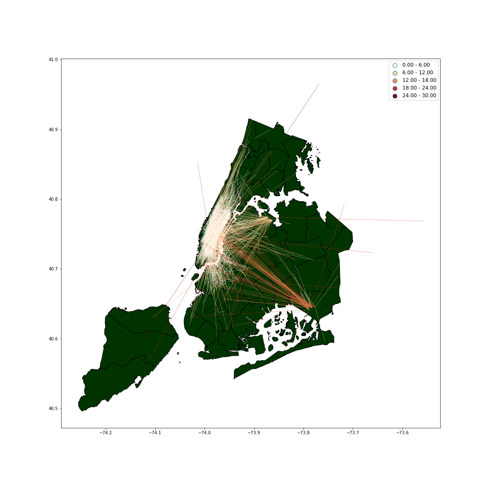
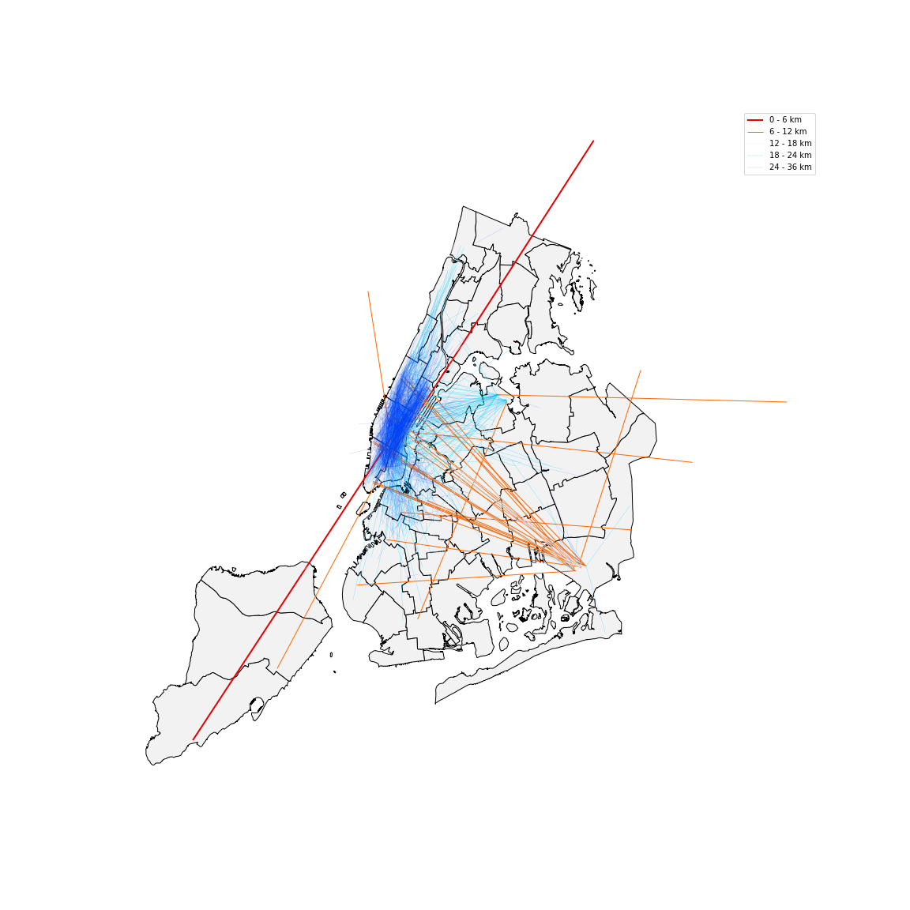

# PUI2018 HW 11

## ASSIGNMENTS:

### Assignment 1. 

Build up two random forest model to predict the different subway card type from 2010-05-23 to 2014-02-02.

### Assignment 2. Improved my plot from HW8 based on the feedback I recieved from my classmates. 

This is the original plot.

#### Suggestion from others
    - add unit in legend
    - not friendly to people with deuteranopia or protanopia
    - Manhattan is totally covered by lines
    - caption failed to explain the data source

Caption: This figure shows 2000 randomly chosen yellow taxi trip in 06/09/2016, the more red line means the longer trip distance, the more blue line means the shorter trip distance. From this plot, we can tell that most taxi trips were within Manhattan, nearly all the long trips were between Manhattan and JFK. The two main destination out of Manhattan is JFK and LaGuardia Airport. There was a relatively active communication between Manhattan and South Brooklyn.

