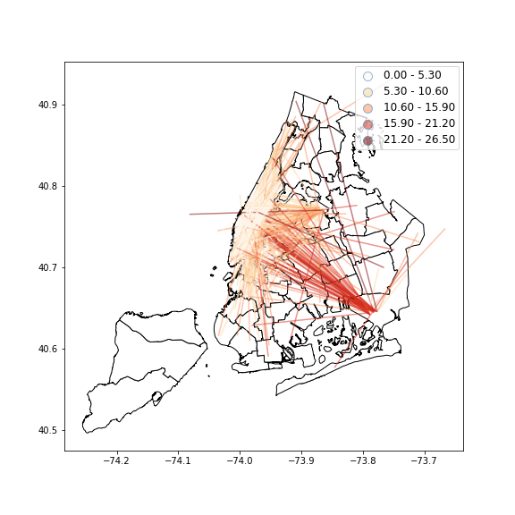

# PUI2018 HW 8

## Assignment 1: Citi-Bike miniproject

I redo the data preporcessing at first, and used Z-test to analysis is there a significant difference among two samples.

[Here is the link to my report on AUTHOREA](https://www.authorea.com/users/249363/articles/335435-comparing-the-proportion-of-citi-bike-commuters-among-different-age)

## Assignment 2: Data Viz

Caption: This figure shows 2000 randomly chosen yellow taxi trip in 06/09/2016, the more red line means the longer trip distance, the more yellow line means the shorter trip distance. From this plot, we can tell that most taxi trips were within Manhattan, nearly all the long trips were between Manhattan and JFK. The two main destination out of Manhattan is JFK and LaGuardia Airport. There was a relatively active communication between Manhattan and South Brooklyn.

