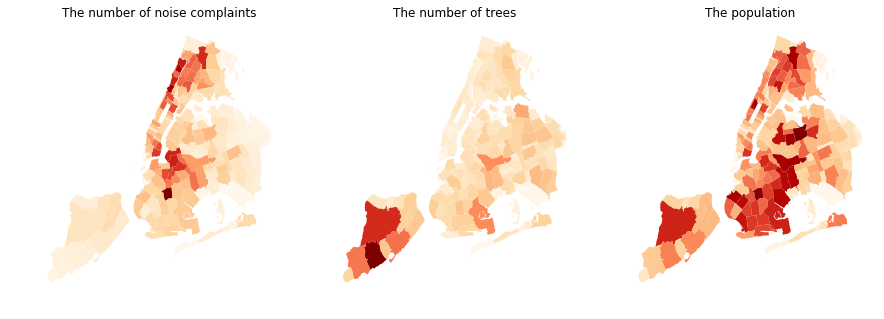

# Plot Review

### Fig 1: Overlay plot of 311 noise complaints and tree data by zipcode

Clarity: Your caption and plot title are very clear, which help to me understand your content. However, the legend is an initial and necessary part of your plot. Without legend, it is hard to tell what different colors points means. 

Esthetic: The colors you chose are beautiful, however, I have some advices to improve it. As you have two data set (311 and tress), I think is might be better to choose a pair of contradict colors like red and blue. Green is a good choice for tree data, I recommend you to use red for 311 data to make your plot more visible.

Honesty: Your plot honestly shows the raw data.

### Fig 2:  Cartographs show the number of noise complaints, the number of trees and the population respectively by zipcode in NYC

Clarity: Still, you might need to add the legend to help to explain your plot.

Esthetic: Red is a striking color, it attracts attention easily, but sometimes red might make people feel dangerous and alert. A series red for 311 data is appropriate as 311 data represents negative phenomenon. I recommend a series of green for the number of trees, and a series of blue or other mild color for the population distribution plot.

Honesty: Your plot honestly shows the raw data.