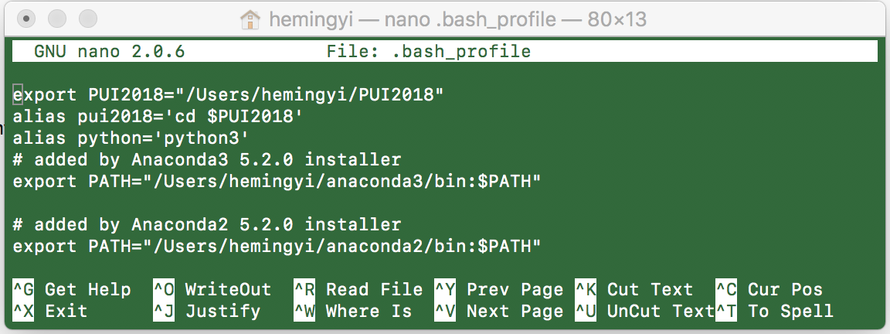

# PUI2018_mh5172

## Environment
I created an alias named as 'pui2018' direct to the directory 'PUI2018' in the home directory, and the detail shows in the following screenshots.

## Extra Credit
HW1-3_mh5172.ipynb is the extra credit assignment in last week.

## Screenshot of command line

## Else

- This README.md file was edited in _Sublime_, this software is able to visualize the markdown syntax.

- I noticed that if there is any space in the images' name in README.md, it will cause trouble.

- There was a mistake in my last assignment, those images above were newly screenshotted.

