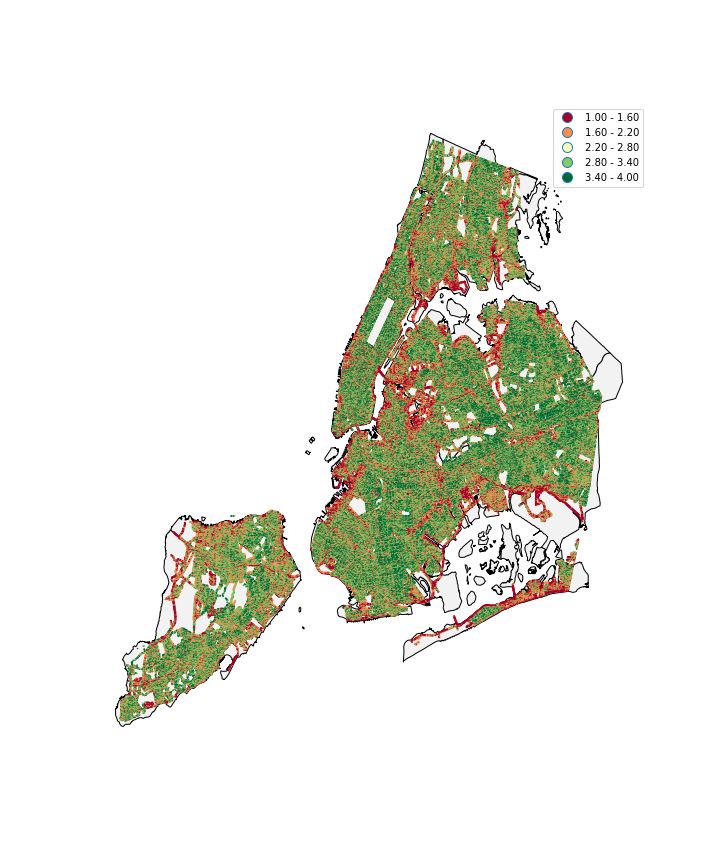
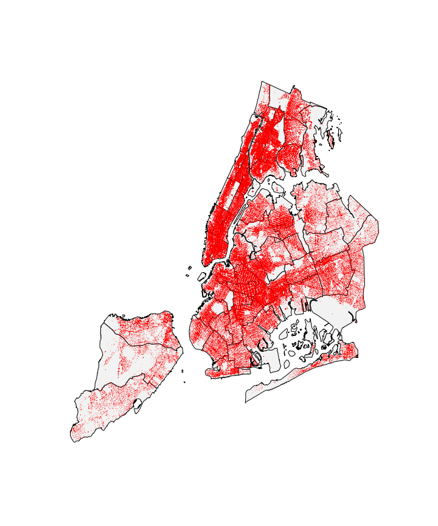

## Perceived Safety Score and Violence 
### extra credit project

### Abstract 

The visual appearance of urban streets has a strong connection to citizens’ behavior. People’s feeling about the outdoor environment is hard to measure and predict. Moreover, the feeling is not equal to fact. In this paper, I used linear regression method to analysis whether the perceived safety score from citizens reflects the real crime amount. In this case, I failed to find any statistically significant relationship between the perceived safety score and violence related crimes.

### Main Plots

Fig 1. The distribution of perceived safety hierarchy in New York City. The redder point means the more people feel dangerous at that location, and the greener point means the more people regard that place as safe

Fig 2. The distribution of violence related crime in New York City in 2011

### Report is published on Authora: 
[Report](https://www.authorea.com/users/249363/articles/343216-title)
